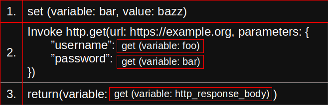

# RTEX Engine

RTEX Engine (Acronym for Real-Time Execution Engine)
is a real-time execution engine for the execution of
instructions represented in associative arrays in
a controlled environment. RTEX is designed to
be used in such environments where you are automating
the task of creating scripts for your program to run,
or you are executing programs written by users,
but you don't want to give them the ability to
execute arbitrary code on your system

## Table of Contents

<!-- TOC -->
* [RTEX Engine](#rtex-engine)
  * [Table of Contents](#table-of-contents)
  * [How does it work?](#how-does-it-work)
    * [Instructions](#instructions)
    * [Methods & Namespaces](#methods--namespaces)
  * [Builtin Instruction Sets](#builtin-instruction-sets)
* [License](#license)
* [Contributing](#contributing)
<!-- TOC -->

-----------------------------------------------------------------------------

## How does it work?

RTEX Engine operates on the simple principle of executing
instructions in order, and then moving on to the next
instruction. 

[README.md](README.md)
### Instructions

Instructions are simply associative arrays that contain
information about the instruction to be executed. The
engine will then execute the instruction, and then
return the context back to the caller.

***Note:*** The below is just an example of what an instruction
might look like. The actual instructions are not implemented



RTEX Engine provides a limited set of instructions by default
allowing for basic functionality and operations, the builtin
functions do not provide a way to interact with the host
system or the filesystem, but you can extend the engine
with your own methods and namespaces

Since instructions are associative arrays, they can be
represented in JSON, which is a common format for data
transfer. The following is an example of a set of 
instructions that is shown above in JSON format:

```json
[
  {
    "type": "set",
    "_": {
      "key": "foo",
      "value": "bar"
    }
  },
  {
    "type": "invoke",
    "_": {
      "method": "http.get",
      "parameters": {
        "url": "https://example.com",
        "parameters": {
          "username": {
            "type": "get",
            "_": {
              "variable": "foo"
            }
          },
          "password": {
            "type": "get",
            "_": {
              "variable": "bar"
            }
          }
        }
      }
    }
  },
  {
    "type": "return",
    "_": {
      "type": "get",
      "_": {
        "variable": "http_response_body"
      }
    }
  }
]
```


### Methods & Namespaces

Methods are different to instructions in the terms
that RTEX can only expand its functionality by
creating a library works as a plugin that can be
imported by RTEX before executing the program.

Namespaces are used to avoid conflicting with
already existing method names and to make things
more organized, for example there could be a
namespace called `http` which contains methods
such as `get`, `post`, `put`, `delete`, etc. which
can be invoked by the engine via the `invoke`
instruction, methods are not the same as instructions
as they are not executed in order, they are executed
when they are invoked.

***Note:*** This functionality is a WIP, more
information will be added as it is implemented

-----------------------------------------------------------------------------

## Builtin Instruction Sets

RTEX Engine comes with a limited set of instructions by default,
but you can extend the engine with your own methods and namespaces

 - base
    - [get](docs/instructions/base/get.md)
    - [set](docs/instructions/base/get.md)
 - math
    - [add](docs/instructions/add.md)

# License

RTEX Engine is licensed under the MIT License, see
[LICENSE](LICENSE) for more information


# Contributing

If you would like to contribute to RTEX Engine,
please read [CONTRIBUTING.md](CONTRIBUTING.md)
for more information
